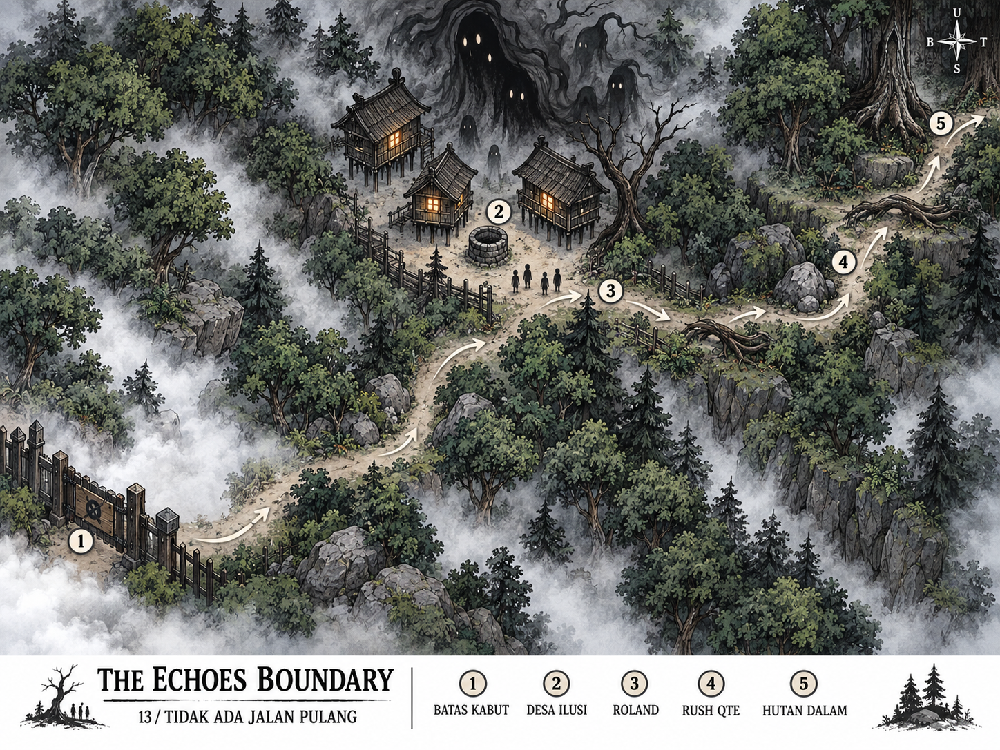

# The Echoes Boundary

World tambahan: Zona Bahaya. Desain untuk minigame 13, Tidak Ada Jalan Pulang.
Status: concept dan spesifikasi level; belum dihubungkan ke runtime.
World house, village, hills, dan boundary yang sudah ada tetap dipertahankan.

## Scope

Referensi: sketsa Map C dan naskah nomor 13 yang diberikan pengguna.
Bagian desa Arthur, persiapan, stealth, investigasi akar, dan timer pencarian
nomor 12 tidak dimainkan di world ini. Pintu di barat daya hanya menjadi
penanda asal kedatangan. Player mulai di tepi desa ilusi bersama tiga teman.

Target durasi awal 60-90 detik termasuk dialog, dengan sprint 25-35 detik.
Angka ini adalah usulan tuning, bukan ukuran yang diwajibkan naskah.
Tidak ada cabang, interior rumah, collectible, atau pertarungan.

## Layout Ringkas

Usulan bounds 1600 x 900 world units. Kamera landscape melihat sekitar
960 x 540 units sebelum penyesuaian aspect ratio. Art concept menunjukkan
komposisi; koordinat berikut menjadi acuan blockout SpriteKit (origin kiri bawah).

| Area | Posisi perkiraan | Fungsi |
| --- | --- | --- |
| 1. Batas kabut | (180, 170) | Gerbang asal; tertutup kabut saat reveal |
| 2. Desa ilusi | (790, 610) | Tiga rumah melayang, satu sumur, arena reveal |
| Spawn party | (650, 460) | Arthur dan tiga teman mulai di sini |
| 3. Roland | (940, 420) | Tarikan otomatis keluar dari sapuan bayangan |
| 4. Rush QTE | (1120, 350) | Koridor pelarian sempit melengkung ke timur |
| 5. Hutan dalam | (1500, 470) | Celah dua pohon besar, jalan naik, fade out |

Jalur pendek dari gerbang ke clearing hanya establishing shot, bukan eksplorasi
tambahan. Rumah berada di belakang clearing, sehingga atap yang melipat dan
Hollow tidak menutupi posisi Arthur. Pohon, pagar rusak, dan batu membatasi
arena. Kabut menutup pinggir map; permukaan jalur dan rintangan tetap terbaca.
Perbedaan ketinggian ditunjukkan teras tanah dan akar, bukan tebing yang harus
dipanjat. Panjang lintasan sprint sekitar 700-900 units mengikuti lengkungan.

## Urutan Gameplay

1. Arrival: party di clearing; Anneth mengatakan "Step back. Now!".
2. Lost return: kamera pan singkat ke gerbang dan pohon bertanda; kabut
   menghapus keduanya. Keneth: "Where is the tree?! Where is the path?!".
3. Manifestation: kamera kembali ke rumah. Cahaya jendela padam, atap melipat,
   tiang larut, dan satu Hollow terbentuk. Gerbang menjadi collision tertutup.
4. Protector: Keneth tersandung; kontrol Arthur diambil sekitar satu detik.
   Roland menariknya dari sapuan bayangan ke mulut koridor.
5. Sprint: Anneth menunjuk celah; kontrol kembali. Tap berulang mempertahankan
   kecepatan dan joystick menggeser Arthur melintang jalur untuk menghindar.
   Anneth dan Keneth memimpin; Roland berlari menempel Arthur.
6. Exit: seluruh party melewati trigger celah, lalu outro Arthur dan fade hitam.
   Bab berakhir di hutan dalam; tidak kembali otomatis ke desa atau puzzle.

Setiap trigger hanya boleh berjalan sekali per attempt. Transisi sinematik
mengunci input sementara dan membersihkan input tertahan sebelum sprint.

## Rush QTE

Lintasan membatasi gerak maju mengikuti jalur; tap menaikkan meter rush dan
joystick tetap dapat dipakai bersamaan untuk menghindar. Jangan memakai tap
pada lantai sebagai navigasi saat fase ini. Hold-to-rush dapat menjadi opsi
aksesibilitas. Nilai meter, kecepatan, dan collision perlu playtest.

Tiga beat terpisah: akar rendah dengan celah kanan, batu dengan celah kiri,
lalu akar di mulut dua pohon besar dengan celah tengah. Setiap celah minimal
dua kali diameter collision Arthur. Rintangan terlihat minimal 1,5 detik
sebelum kontak; fog dan camera shake tidak menghapus waktu baca tersebut.

Tabrakan mengurangi rush dan memperkecil jarak aman terhadap Hollow. Ketika
jarak habis, fade singkat dan retry di awal sprint, tanpa mengulang dialog
panjang. Checkpoint menyimpan fase, bukan posisi di tengah tabrakan.
Hollow adalah ancaman pengejar, tidak memiliki health bar atau serangan player.
Saat pause atau aplikasi masuk background, timer, meter, dan pengejar berhenti.

## Visual dan Audio

Hijau hutan kusam, batu abu-abu, kabut putih dingin, jendela hangat yang padam.
Rumah menggantung tanpa tapak kaki dan larut menuju satu siluet Hollow.
Audio berubah dari hening ke kayu tertekuk, kain tertarik, langkah tergesa,
dan napas Hollow. Stereo membantu arah, tetapi celah keluar tetap terbaca visual.
Reduce Motion menonaktifkan shake dan mengganti deformasi cepat dengan dissolve.
Angka, panah, dan judul pada concept hanya anotasi desain, bukan HUD gameplay.

## Integrasi yang Diusulkan

Tambahkan world ID baru setelah mapping puzzle dan unlock disepakati; jangan
mengganti arti atau raw value case PuzzleWorld yang ada. Hindari memakai ulang
piece IDs milik boundary. Unlock menggunakan hasil event sebelumnya yang
disebut dalam naskah, bukan sekadar membuka app atau memasuki world lama.

Data level baru dapat ditempatkan di Models/Worlds/EchoesBoundaryLevel.swift,
state encounter di Models/EchoesBoundaryProgress.swift, logika rush di
Systems/EchoesBoundaryChase.swift, dan adapter SpriteKit di
Scenes/EchoesBoundary/. Scene encounter khusus sesuai karena kontrol sprint
dan urutan scripted berbeda dari eksplorasi bebas; gunakan kembali karakter
dan kontrol yang relevan. Tambahkan field save opsional dengan default agar
save lama tetap terbaca. Ini rencana integrasi, belum perubahan source game.

## Acceptance Saat Implementasi

- World lama dan save lama tetap dapat dibuka.
- Gerbang pulang tertutup sebelum kontrol sprint kembali.
- Roland save terjadi sekali; rush dapat ditap sambil menghindar.
- Tiga rintangan selalu punya celah, termasuk pada layar iPhone kecil.
- Retry, pause/resume, dan Reduce Motion tidak membuat encounter macet.
- Outro hanya dimulai sesudah seluruh party melewati exit.

## Pembuatan Concept

Concept dibuat dengan tool imagegen bawaan, menggunakan sketsa sebagai
referensi komposisi. Prompt lengkap tersimpan di prompt.txt. Concept merupakan
referensi art dan blockout, bukan tekstur map siap pakai atau collision mesh.
